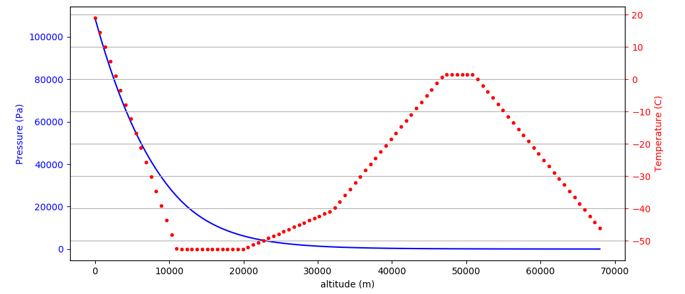

# Aerospace_utils

Aerospace_utils aims to be a collection of useful functions to calculated
aeronautical and aerospace related parameters and results.

I don't pretend to create a very complex library with infinite functionallity, but
I'll try to add everything I would need for ease calculations needed in my carrer.

# Tools
## ISA

ISA (International Standard Atmosphere) is an ideal model for Earth Atmosphere,
which don't take into account non-idealities of gases, wheater conditions or
other gases as water vapor or suspended particles or dust.

### isa.py
isa.py implements a series of functions like isa_calc, which calculates the
thermodynamical variables of the air at a given altitude.

Usage: `gas_state, layer = isa_calc(altitude)`
where:

- gas_state = object containing the thermodynamical values at given altitude:
  - gas_state.T = Temperature in kelvin
  - gas_state.p = pressure in Pa
  - gas_state.rho = density in Kg/m<sup>3</sup>
- layer = the number of the layer at given altitude
- altitude: in meters above sea level

### isa_print.py
This functions is a simple way to print the results of isa_calc to screen in a command line

Usage: python isa_print.py <altitude_in_meters>

Example:
```
python isa_print.py 9000
At 9000 you are in the Tropsosphere
  Temperature:  233.65 K = -39.5 degree Celsius
  Pressure:  33630.13 Pa
  Density:  0.50151 kg/m^3
```

### isa_plot.py
This function creates a plot for different thermodynamical parameters as a function of
the altitude for a given range.

For a range between 0 to 68000 m the plot will look like:
```
from isa_plot import isa_plot as plt
plt(h=0,h=68000,N=100)
```


